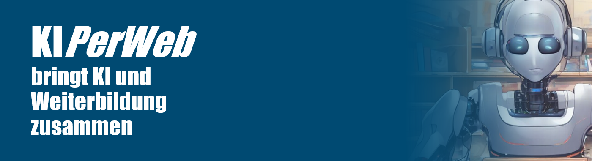

# KIPerWeb
Sie sind Bildungsanbieter und wollen mit KI ihre (Weiter-)Bildungsangebote personalisieren? Sie sind Entwickler und wollen ihre KI weiterbilden? Oder sind Sie selbst auf der Suche nach Weiterbildung zu KI-bezogenen Fragestellungen? Dann sind Sie hier genau richtig!

Das ursprüngliche *Projekt* ["KI-gestützte Personalisierung in der berufsbezogenen Weiterbildung (KIPerWeb)"](https://www.f-bb.de/unsere-arbeit/projekte/ki-gestuetzte-personalisierung-in-der-berufsbezogenen-weiterbildung-kiperweb/) hat zwischen 01.05.2021 und 30.04.2024 das Potenzial von KI-Technologien für die personalisierte und adaptive berufsbezogene Weiterbildung untersucht und einen regelmäßigen Austausch mit Expertinnen und Experten aus Wissenschaft und Praxis angestoßen, der seitdem projektübergreifend den Stand der Kunst reflektiert und vorantreibt. Dieser Austausch zu aktuellen KI-bezogenen Fragestellungen wird seit dem 01.05.24 ehrenamtlich im Sinne einer offenen Community of Practice (*CoP KIPerWeb*) fortgeführt.

## CoP KIPerWeb
Seit 01.05.2024 wird der regelmäßige informelle und offene Austausch zu aktuellen KI-bezogenen Fragestellungen ehrenamtlich weitergeführt im Sinne einer *Community of Praxis zur digital souveränen Nutzung und Entwicklung KI-gestützter Webanwendungen* (CoP KIPerWeb). Bis auf weiteres finden Sitzungen der *CoP KIPerWeb* jeden zweiten Freitag 10-11h online statt. Sollten Sie Interesse haben, Teil dieser informellen und v.a. offenen KIPerWeb-Austauschrunde von Expertinnen und Experten aus Wissenschaft und Praxis zu werden, wenden Sie sich für die Zugangsdaten gerne an Dr. Andreas Fischer (andreas.fischer@f-bb.de)! Sollten Sie Themenvorschläge für künftige Sitzungen einbringen wollen, können Sie diese ebenfalls per E-Mail oder direkt auf GitHub via Pull-Request einbringen. Informationen zu den Terminen und Inhalten der Austauschrunde können Sie der folgenden Tabelle entnehmen.

### Termine
Sitzung | Datum | Thema
-------- | -------- | --------
1   | 03.05.24   | Potenziale von KI für die Berufs- und Studienorientierung
2   | 17.05.24 | Substituierbarkeitspotenziale - KI und die Arbeit von morgen
3   | 31.05.24 | Schreibassistenz KI - praktische Prompts und Tipps für den Arbeitsalltag
4   | 14.06.24 | HuggingChat Tools und wie man sie in eigene Chatbots einbindet
5   | 28.06.24 | Chatbots mit Large Language Models realisieren - Varianten & Best Practice 
6   | 12.07.24 | Knowledge Graphs & Retrieval-Augmented Generation
7   | 26.07.24 | \*tba\*

**Themenspeicher für künftige Sitzungen:** "Persönliche KI-Assistenten lokal und on-premises betreiben", "LLM-Chatbots & Web-Search-Augmented Generation", "Wie gestalte ich LLM-Chatbots rechtssicher und praxistauglich?", "Tools für die effiziente Gestaltung von RAG-Pipelines", "KI-Tagebuch - Tipps für Aufnahme, Transkription und Auswertung?", "Implikationen des EU-AI-Act für KI in der Bildungspraxis", "KI & Urheberrecht - Stand der Dinge und absehbare Entwicklungen", "KI und Nachhaltigkeit - ökologisch, ökonomisch & sozial", "AI Literacy und verwandte Konstrukte" 

## Projekt KIPerWeb

### Projekt-Tagung "KI-gestützte Personalisierung in der berufsbezogenen Weiterbildung"
Am 19.04.2024 fand die [Abschlusstagung zum *Projekt* KIPerWeb](https://www.f-bb.de/unsere-arbeit/veranstaltungen/abschlusstagung-des-projekts-ki-gestuetzte-personalisierung-in-der-berufsbezogenen-weiterbildung/) statt, organisiert vom Forschungsinstitut Betriebliche Bildung (f-bb). Im Rahmen von Fachbeiträgen aus dem Projekt und aus weiteren Projekten des Innovationswettbewerb konnten aktuelle Erkenntnisse zur KI-gestützten Personalisierung in der berufsbezogenen Weiterbildung in einen größeren Zusammenhang gestellt und reflektiert werden.
Das [Tagungsprogramm](https://www.f-bb.de/fileadmin/Projekte/KIP/KIPerWeb-Abschlusstagung_Programm.pdf) umfasste folgende Beiträge:

- Pfeiffer, I. (2024). Begrüßung. [[PDF]](src/Abschlusstagung/Pfeiffer_2024.pdf)
- Fischer., A. (2024). KI in der berufsbezogenen Weiterbildung - Möglichkeiten im Überblick. [[PDF]](src/Abschlusstagung/Fischer_2024.pdf)
- Schley, T. & Paaßen, B. (2024) Projektvorstellung KIPerWeb. [[PDF]](src/Abschlusstagung/Schley_Paaßen_2024.pdf)
- Weber, M. (2024). Vom LMS zur LXP. [[PDF]](src/Abschlusstagung/Weber_2024.pdf)
- Haselmann, R. (2024). KI Ansätze in Lernmanagementsystemen. [[PDF]](src/Abschlusstagung/Haselmann_2024.pdf)
- Junghans, K., (2024). Kursempfehlungen vom Chatbot. [[PDF]](src/Abschlusstagung/Junghans_2024.pdf)
- Fleckenstein, M. & Prästin, B. (2024). Wissenszuwachsvorhersage - sinnvolle Einsatzfelder. [[PDF]](src/Abschlusstagung/Fleckenstein_Prästin_2024.pdf)
- Wittke, A., & Hürten, P. (2024). Der KI Competence Analyser : Innovative Lösung zur Kompetenzerfassung und anerkennung. [[PDF]](src/Abschlusstagung/Wittke_Hürten_2024.pdf)
- Herkula, H., Jäser, K., Michalk, S., Karaguiozian, D. (2024). Ethische Überlegungen zu Künstlicher Intelligenz als Werkzeug innerhalb der Weiterbildung. [[PDF]](src/Abschlusstagung/Herkula_2024.pdf)
- Rasch, J. (2024). Skill-basierte Multi Stakeholder Recommender Systeme für die berufliche Weiterbildung.
- Lichtenberg, T. & Dittmann, P. (2024). Digitale Avatare und LLMs im Live Streaming.
- Lorenz, S. (2024). Abschluss und Fazit [[PDF]](src/Abschlusstagung/Lorenz_2024.pdf)

Die vorliegenden Folien zur Tagung (im PDF-Format) können Sie auch gesammelt [hier](https://github.com/AndreasFischer1985/KIPerWeb/raw/main/src/Abschlusstagung/Slides_Abschlusstagung.zip) herunterladen.

### Publikationen

- Fischer, A., Jöchner, A., Pabst, C., Lorenz, S., Schley, T. (2023): KI-basierte Personalisierung berufsbezogener Weiterbildung. Ein Praxisleitfaden für Bildungsanbieter. In: S. Kretschmer & I. Pfeiffer (Hrsg.), Leitfaden für die Bildungspraxis (73, 3-39). https://doi.org/10.3278/9783763976447.

- Fischer, A., Pabst, C., Jöchner, A., Lorenz, S., Schley, T. (2022). Möglichkeiten, Bedarfe und Wünsche bezüglich der Personalisierung berufsbezogener Weiterbildung. bwp@, 43, 1-43. https://www.bwpat.de/ausgabe/43/fischer-etal

- Fischer, A., Pabst, C., Lorenz, S. (2024): Empfehlungen zur beruflichen Weiterbildung. Entwicklung eines KI-basierten Entscheidungsmanagements. In: BWP 1/24. https://www.bwp-zeitschrift.de/dienst/publikationen/de/19425

- Pabst, C., Jöchner, A., Fischer, A., Lorenz, S., Schley, T. (2023): Modularisierung berufsbezogener Weiterbildung. Ein Praxisleitfaden für Bildungsanbieter. In: S. Kretschmer & I. Pfeiffer (Hrsg.), Leitfaden für die Bildungspraxis (74, 3-30). https://doi.org/10.3278/9783763976461.

- Paaßen, B., Dywel, M., Fleckenstein, M., Pinkwart, N. (2022). Interpretable Knowledge Gain Prediction for Vocational Preparatory E-Learnings. In: M. Rodrigo, N. Matsuda, A. Cristea, V. Dimitrova (Hrsg.). Tagungsband der International Conference on Artificial Intelligence in Education (Teil II). Lecture Notes in Computer Science, vol. 13356 (S. 132-137). Springer, Cham. https://doi.org/10.1007/978-3-031-11647-6_23

- Paaßen, B., Dywel, M., Fleckenstein, M., Pinkwart, N. (2022b). Sparse Factor Autoencoders for Item Response Theory. In: A. Cristea, C. Brown, T. Mitrovic, N. Bosch (Hrsg.) International Conference on Educational Data Mining (S. 17-26). International Educational Data Mining Society. https://doi.org/10.5281/zenodo.6853067

- Paaßen, B., Göpfert, C., Pinkwart, N. (2022). Faster Confidence Intervals for Item Response Theory via an Approximate Likelihood. In: A. Cristea, C. Brown, T. Mitrovic, N. Bosch (Hrsg.) International Conference on Educational Data Mining (S. 555-559). International Educational Data Mining Society. https://doi.org/10.5281/zenodo.6852950

- Pabst, C., Lorenz, S. (2022): Smarte Empfehlungen für personalisiertes Lernen. Künstliche Intelligenz in der berufsbezogenen Weiterbildung. f-bb Infoforum  04/2022. https://www.f-bb.de/newsletter-042022/smarte-empfehlungen-fuer-personalisiertes-lernen/ 

- Palomino, A., Fischer, A., Kuzilek, J., Nitsch, J., Pinkwart, N., Paaßen, B. (accepted). EdTec-QBuilder: A Semantic Retrieval Tool for Assembling Vocational Training Exams in German Language. NAACL 2024 -- Demo Track. https://2024.naacl.org/program/accepted_papers_demo/

### KIPerWeb-Prototypen
Prototypen für die KI-gestützte Kursempfehlung hat das DFKI im Rahmen des Projekts KIPerWeb online unter der Lizenz Apache 2.0 veröffentlicht:
- https://github.com/DFKI/kiprec
- https://github.com/DFKI/kip-deploy
